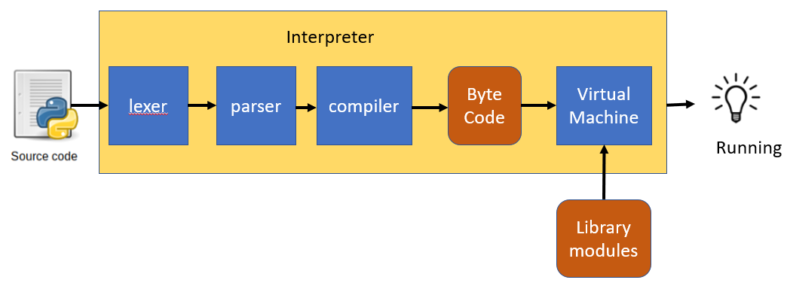
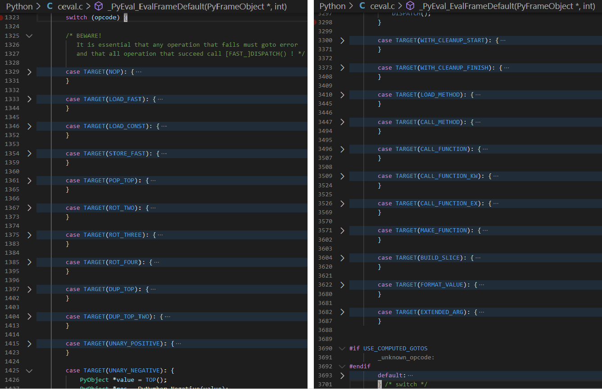

# Usages
- run python file

  ```
  python test.py
  ```

- run a module

  -m: module 

  ```
  python -m pdb test.py
  python -m pydoc -p 9000
  ```

- input from stdin

  ```
  (base) PS C:\> python
  Python 3.7.4 (default, Aug  9 2019, 18:34:13) [MSC v.1915 64 bit (AMD64)] :: Anaconda, Inc. on win32
  Type "help", "copyright", "credits" or "license" for more information.
  >>>     
  ```
  
- -c: source from command line

  ```
  python -c "import shutil;shutil.copytree('./tflexdb', './tflexdb.backup', ignore=lambda src,names:[name for name in names if name.endswith('.log')])"
  ```
  Sometime it is useful to use it in bash script if it is hard to implement with pure bash scripts.

- run a package directory with main
  - package with \_\_main\_\_.py
  ```
  [willchen@fdev060101 py]$ python run_package/
  ('my_print:', 'Hello')
  [willchen@fdev060101 py]$ python xmlrpc/
  /usr/local/anaconda2/bin/python: can't find '__main__' module in 'xmlrpc/'
  ```

>See again from input scale: stdin, cmd_line, file, module, pcakge
# Go Over Interpreter

## Interpreter
### Byte Code: op_code + stack_index
```
>>> add = lambda a1 ,a2 : a1 + a2
>>> add(1,3)
4

>>> add.__code__.co_code # the bytecode as raw bytes
b'|\x00|\x01\x17\x00S\x00'
>>> list(add.__code__.co_code) # the bytecode as numbers
[124, 0, 124, 1, 23, 0, 83, 0]

>>> import dis
>>> dis.dis(add) # (line number, index of bytecode, op_name, stack index, varialbe name)
  1           0 LOAD_FAST                0 (a1)
              2 LOAD_FAST                1 (a2)
              4 BINARY_ADD
              6 RETURN_VALUE
>>>   
```

In C Python, there is a very long swith case code for op handle

Virtual Machine is a Stack Manipulator
### Frame
#### Traceback
```
Traceback (most recent call last):
  File "C:\Users\willchen\AppData\Local\Continuum\anaconda3\envs\py27\lib\pdb.py", line 1314, in main
    pdb._runscript(mainpyfile)
  File "C:\Users\willchen\AppData\Local\Continuum\anaconda3\envs\py27\lib\pdb.py", line 1233, in _runscript
    self.run(statement)
  File "C:\Users\willchen\AppData\Local\Continuum\anaconda3\envs\py27\lib\bdb.py", line 400, in run
```
Traceback are hierarchical frames from new to old.
#### [Frame](https://aosabook.org/en/500L/a-python-interpreter-written-in-python.html)
- A frame is a collection of information and context for a chunk of code.
- Frames are created and destroyed on the fly as your Python code executes.
- In general, there's a frame for each scope in a Python program. For example, each module, each function call, and each class definition has a frame.

### Running
1. Each Frame parse its __code__.co_code to manipulate its data stack;
2. The OP_Code RETURN_VALUE tells the interpreter to pass a value between frames.
   - First it will pop the top value off the data stack of the top frame on the call stack.
   - Then it pops the entire frame off the call stack and throws it away.
   - Finally, the value is pushed onto the data stack on the next frame down.
# pyc and pyo
## pyc
```
python -m py_compile xxxx.py
```
compile a source file to byte-code.

## pyo
```
python -O -m py_compile xxxx.py
```
module compileall can also do the same thing for pyc and pyo
```
python -m compileall xxx.py
python -OO -m compileall xxx.py
```
# Other
## options
- -O:

  Remove assert statements and any code conditional on the value of \_\_debug\_\_. 

- -OO:
  
  Do -O and also discard docstrings

- -B

  If given, Python won’t try to write .pyc files on the import of source modules


See more from "Python » 3.8.2 Documentation » Python Setup and Usage » "

## Environment variables
PYTHONPATH: add packages to sys.path

demo:
```
env PYTHONPATH=/home/willchen/usr/py/site-packages/ python -m pudb mutau_evaluation.py
```

For more options and environment variables see "Python » 3.8.2 Documentation » Python Setup and Usage » "